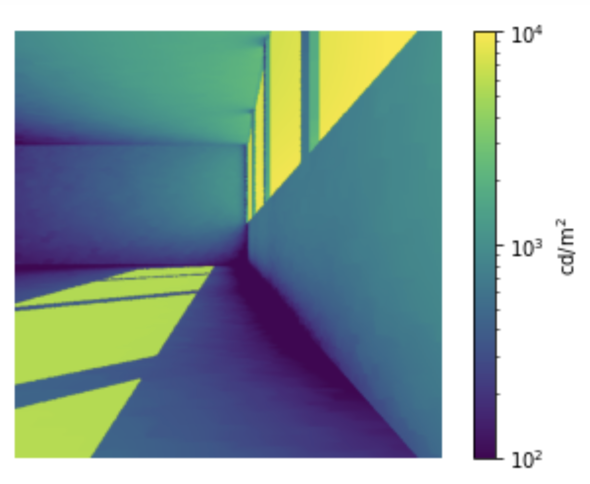
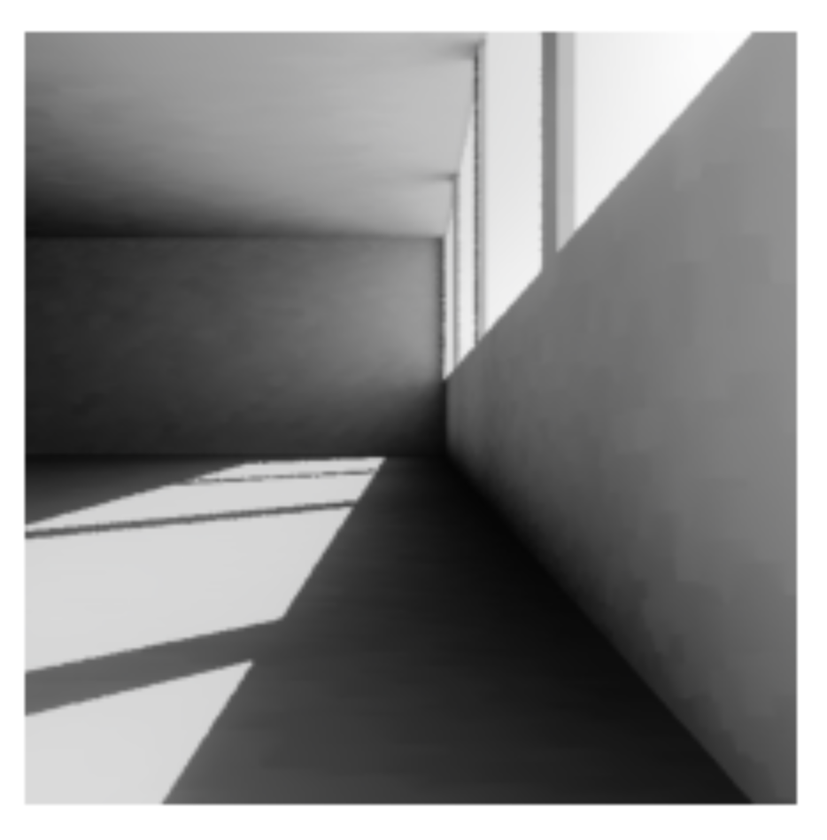

# Quickstart

## Importing pyradiance
After installing pyradiance, it can be imported as follows:
```python
import pyradiance as pr
```
We use an alias `pr` here to improve code readability.

## Creating a scene

Here we are using RADIANCE files created beforehand to create a scene object used for rendering.

First, we instantiate a `Scene` object by giving it a name.

```python
scene = pr.Scene("ascene")
```
Next, we start adding materials and surfaces to the scene from local directories.
```Python
scene.add_material("Objects/materials.mat")
scene.add_surface("Objects/walls.rad")
scene.add_surface("Objects/ceiling.rad")
scene.add_surface("Objects/floor.rad")
```
Similar, we add our light sources:
```python
scene.add_source("Sources/sky.rad")
```
In order to render a image, we'd also need to define camera/view.
Here, we are defining a view at (1, 1, 1.5), facing (1, 0, 0). We use default values for the rest of the view parameters.
```python
aview = pr.create_default_view()
aview.vp = (1, 1.5, 1)
aview.vdir = (1, 0, 0)
```
Then, we add this view to our scene.
```python
scene.add_view(aview)
```

!!! note
    Scene object here is only used for [render()](reference.md#pyradiance.render) function. Regular RADIANCE functions such as [rpict()](reference.md#pyradiance.rpict), 
    [rtrace()](reference.md#pyradiance.rtrace), [rcontrib()](reference.md#pyradiance.rcontrib) 
    currently doesn't take `Scene` as input.  These 'raw' RADIANCE functions takes file paths as input instead, as they do in RADIANCE CLI.

## Rendering a scene
A scene can be rendering using the [render()](reference.md#pyradiance.render) function. The `render()` function has a few optional arguments.
RADIANCE, by default, uses zero ambient bounce, which we can overwrite by defining the `ambbounce` argument:
```python
image = pr.render(scene, ambbounce=1)
```
The render function returns the generated `.hdr` image as bytes. 

## Visualizing an image
We can visualize the image using popular computing and plotting library such as numpy and matplotlib.

### Falscolor image
Falsecolor-ing an image is a common practice in quantitative analysis. An falsecolor image maps the full range of an HDR image into a color scale.
First, we convert our `image` into a numpy array. This is usually the first step before any analysis in Python, since most of the analysis and 
visualization library recognize the `numpy.ndarray` object. We use [pvalue()](reference.md#pyradiance.pvalue) and 
[get_image_dimension()](reference.md#pyradiance.get_image_dimensions) function for this step. 
```python
import numpy as np
xres, yres = pr.get_image_dimensions(image)
pixels = pr.pvalue(image, header=False, outform='f', resstr=False)
iar = np.frombuffer(pixels, dtype=np.single).reshape(xres, yres, 3)
```
!!! note
    Notice the `outform` argument in the `pvalue()` function and `dtype` argument in the `np.frombuffer()` function need to match. 
    In this case, both are indicating the output and input data format to be single precision float.
    We also need to remove header and resolution string from the pvalue output.

Now we have the image as numpy array, `iar`. The shape of this array is xres by yres by 3, where 3 represents the RGB channels.
We are, however, usually interested in radiance or luminance values for each pixel. To do that we can weight the RGB channels to get our luminance values.
This is trivial now with numpy array.
```python
luminance = iar[:, :, 0] * 47.4 + iar[:, :, 1] * 119.9 + iar[:, :, 2] * 11.6
```
With the luminance values as another numpy array, we can use the matplotlib library to plot the image.
```python
import matplotlib.pyplot as plt

# using a viridis color map
cmap = plt.cm.viridis

# setup a logrithm normalizer
norm = LogNorm()

plt.axis("off")
fimage = cmap(norm(luminance))
plt.colorbar(plt.cm.ScalarMappable(norm=norm, cmap=cmap), label=r"$\mathrm{cd/m^2}$")
```
{: style="height:250px;width:300px"}

### Tonemapping
We can use [pcond()](../reference/#pyradiance.pcond) function to apply more advanced tonemapping 
techniques, e.g., applying a human vision adaption. `pcond()` function, however, takes a image file as input, so we 
need to write our `.hdr` image into a file before we can call `pcond()`.
```python
with open("raw.hdr", "wb") as wtr:
    wtr.write(image)
timage = pr.pcond("raw.hdr", human=True)
```
Next we can convert this tonemapped HDR into a numpy array and visualize it using matplotlib. 
```python
tpix = pr.pvalue(timage, header=False, resstr=False, outform='f')
tiar = np.frombuffer(tpix, dtype=np.single).reshape(xres, yres, 3)
plt.imshow(tiar*(1.0/2.2))
```
!!! note
    Notice we apply a 2.2 gamma correction here.
{: style="height:250px;width:250px"}


